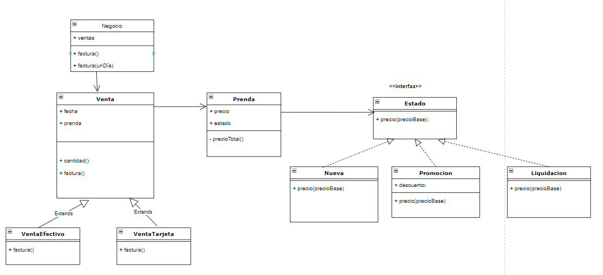

<div align="center">
    
    <h1>Maco Wins</h1>
</div>

<p align="center">
    
  <br/> 
</p>

## Glosario

- [:clipboard: Enunciado](#enunciado)
- [:rocket: Solución](#solucion)

---

<a name="enunciado"></a>

## :clipboard: Enunciado

Este es el código base del TP de Macowins, cuyo enunciado [se puede encontrar acá](https://docs.google.com/document/d/1mjWKl9YH9Bb39iIUl1bQj_xhx_-CjCAMpcAXRqKhVjU/edit#heading=h.ijowozxsedv6). Está diseñado para: 

* Java 8. :warning: Si bien el proyecto no lo limita explícitamente, el comando `mvn verify` no funcionará con versiones mas modernas de Java. 
* JUnit 5. :warning: La versión 5 de JUnit es la más nueva del framework y presenta algunas diferencias respecto a la versión "clásica" (JUnit 4). Para mayores detalles, ver: 
  *  [Apunte de herramientas](https://docs.google.com/document/d/1VYBey56M0UU6C0689hAClAvF9ILE6E7nKIuOqrRJnWQ/edit#heading=h.dnwhvummp994)
  *  [Entrada de Blog (en inglés)](https://www.baeldung.com/junit-5-migration) 
  *  [Entrada de Blog (en español)](https://www.paradigmadigital.com/dev/nos-espera-junit-5/)
* Maven 3.3 o superior


#### ¿Cómo resolver el TP?

1. Leé el enunciado atentamente
2. Tratá de resolverlo en orden
3. Mientras vas implementando el código que resuelve el problema, codificá casos de prueba que validen la solución. Ya te dejamos algunos para que completes y te sirvan como punto de partida, pero no son suficientes y deberás agregar los tuyos.

#### ¿Cómo configurar el IDE?

 1. Tabular con dos espacios
 2. Instalar y configurar Checkstyle
 3. Usar fin de linea unix


#### ¿Cómo ejecutar los tests?

```
mvn test
```

#### ¿Cómo validar el proyecto?

```
mvn verify
```

Este comando hará lo siguiente:

 1. Ejecutará los tests
 2. Validará las convenciones de formato mediante checkstyle
 3. Detectará la presencia de (ciertos) code smells
 4. Validará la cobertura del proyecto

#### Entrega del proyecto

Para entregar el proyecto, crear un tag llamado `entrega-final`. Es importante que antes de realizarlo se corra la validación
explicada en el punto anterior. Se recomienda hacerlo de la siguiente forma:

```
mvn clean verify && git tag entrega-final && git push origin HEAD --tags
```

#### Configuración del IDE (IntelliJ)

 1. Tabular con dos espacios: 
 2. Instalar y configurar Checkstyle:
    1. Instalar el plugin https://plugins.jetbrains.com/plugin/1065-checkstyle-idea:
    2. Configurarlo activando los Checks de Google: 
 3. Usar fin de linea unix
    1. En **Settings/Preferences**, ir a a **Editor | Code Style**.
    2. En la lista **Line separator**, seleccionar `Unix and OS X (\n)`.  
 

---

<a name="solucion"></a>

## :rocket: Solución


#### Diagrama de clases



#### Explicacion


* Para el método de pago se aplicó el patrón template method donde en la clase abstracta se implementó el cálculo base de la factura y de ahí se extendió a las clases de VentaEfectivo y VentaTarjeta donde cada uno sobrescribio el comportamiento de factura.

* Para el estado de la prenda aplique el patrón strategy debido a que por cada estado tenía un comportamiento particular, pero todos afectaban al cálculo del precio. Al aplicar este patrón es más flexible y no esta acoplado el comportamiento del precio al estado.


